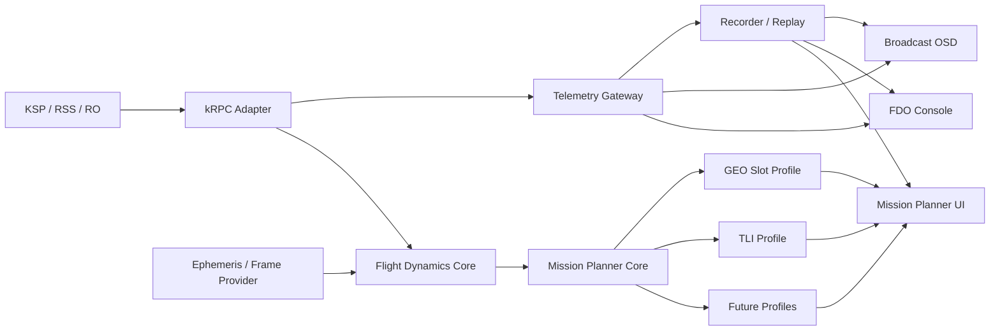

# KSP Mission Display & Mission Planner

> kRPC 驱动的 RSS/RO 发射数据面板、飞行动力学控制台与多任务窗口规划器

- 文档状态：开发基线（Draft 2 / Phase 1 connection implemented）
- 编写日期：2026-07-15
- 目标环境：KSP 1.12.x、RSS/RO/RP-1、kRPC
- 工作名称：KSP Mission Display（KMD）

## 1. 项目摘要

本项目提供一个共享 kRPC 数据后端和三套浏览器界面：

1. **Broadcast OSD**：供 OBS 使用的发射直播叠加层。
2. **FDO Console**：显示发射姿态、速度、动压、姿态球、星下点航迹、轨道、推进、制导和任务事件的工程控制台。
3. **Mission Planner**：通过可插拔 Mission Profile 规划任务窗口。当前 Profile 包含 GEO 槽位注入、J2 太阳同步轨道设计和 TLI；后续扩展 TMI 与自定义目标。

项目首先追求与 KSP/RSS/RO 内部状态一致，再逐步增加有限燃烧、摄动和多体传播。任何窗口结果都必须携带参考系、历元、单位和模型精度，不允许把 KSP 内部参考系直接标成现实世界的 J2000、GCRF 或 ITRF。

## 2. 产品目标

### 2.1 核心目标

- 从 kRPC 稳定读取飞行器、轨道、天体、分级和推进数据。
- 在 1920×1080 与 2560×1440 下提供可直接作为 OBS Browser Source 的透明 OSD。
- 提供可读性优先的 FDO/任务控制屏，并支持历史曲线与任务事件回放。
- 提供独立于任务类型的发射 FDO 数据：姿态、速度、Q、Mach、姿态球与星下点航迹。
- 使用 Mission Profile 定义各任务的目标函数、约束、候选字段和验收条件。
- 支持 GEO 的 AN/DN、GTO、远地点经度与槽位误差，以及 TLI 的月球相位、C3、近月点和飞行时间。
- 区分“停车轨道点火机会窗口”和“从发射时刻反算的完整任务窗口”。
- 支持第一圈、首个可用 AN/DN、发动机点火次数和有限燃烧时间等实际约束。
- 对参考系和经度转换进行运行时健康检查；检查失败时禁止发布窗口结果。
- 保存计划值与实际飞行数据，支持事后比较和模型校准。

### 2.2 非目标

第一阶段不包含：

- 自动控制节流、姿态或分级。
- 自动执行机动节点。
- 完整复制现实 IERS Earth Orientation、UT1、极移和岁差章动模型。
- 未经验证就宣称支持 Principia 或任意多体引力模组。
- 复制 SpaceX、NASA、JAXA 的商标、标识或受保护直播包装。

第一阶段的所有规划结果均为**辅助决策信息**，不是自动飞控指令。

## 3. 典型使用场景

### 3.1 发射直播

操作者启动 KSP 与 kRPC 后，在 OBS 中加入透明网页源。页面实时显示 T+、速度、高度、轨道远近点、推重比、事件和级间燃料，并可切换干净模式或工程模式。

### 3.2 停车轨道至 GTO

飞行器进入停车轨道后，规划器搜索未来若干次 AN/DN：

- 输出节点类型、点火 UT/MET、倒计时、GTO 目标和远地点到达时间。
- 计算转移远地点星下点经纬度及其相对 110°E 的误差。
- 比较首个节点、后续节点、直接 GTO 和漂移同步方案。
- 若推进或点火次数不满足要求，候选必须标记为不可执行。

### 3.3 首个 DN 直送 GTO 的发射窗口

以固定发射场、上升程序、分级时间和二级滑行为输入，反算发射 UT，使二级二次点火发生在首个可用 DN 附近，并使注入后的远地点地固经度满足目标。该场景对应 H3/QZSS 风格的任务设计，但不预设必须选择 DN；AN 与 DN 均由求解器评估。

### 3.4 GEO 漂移与锁定

若直接注入无法在一次任务中同时满足经度、倾角和剩余 Δv，规划器给出：

- 亚同步或超同步漂移轨道周期。
- 预期经度漂移方向和速率。
- 到达目标槽位的预计时间。
- 进入和退出漂移轨道的估算 Δv。

### 3.5 停车轨道至 TLI

飞行器进入 LEO 后，TLI Profile 搜索可用的地月转移注入机会：

- 以月球星历/相位、目标近月点高度、C3 或注入能量和最大飞行时间为约束。
- 输出点火 UT/MET、倒计时、预计 Δv、飞行时间、近月点和到达时刻。
- 候选按可行性、月球相位误差、近月点误差、Δv 和任务约束排序。
- 不使用 GEO 的地固经度误差作为 TLI 目标函数。

### 3.6 Profile 扩展

规划器不得通过复制整个页面增加新任务。每个 Profile 只实现：

- 输入 schema 与默认参数。
- 目标函数、约束和候选排序。
- 任务专属结果字段和可视化描述。
- 对所需动力学等级、星历和参考系 Provider 的声明。

共享遥测、时间、单位、参考系、事件检测、记录回放和 UI 组件不随 Profile 复制。

## 4. 系统架构



### 4.1 模块职责

#### kRPC Adapter

- 管理连接、重连与连接状态。
- 按唯一标识和名称绑定飞行器，处理分级后 active vessel 变化。
- 读取 kRPC 原始数据并转换为统一 SI 单位。
- 对未发射、着陆、逃逸、无有效轨道等状态进行分类。
- 不在此层执行轨道优化。

#### Telemetry Gateway

- 提供版本化 WebSocket/HTTP 接口。
- 合并快通道、慢通道、事件和规划结果。
- 控制广播频率与背压。
- 向多个前端提供相同数据契约。

#### Flight Dynamics Core

- 管理状态向量、轨道要素、时间与参考系转换。
- 提供两体传播、节点检测、远近点检测和事件求根。
- 后续增加有限燃烧、J2、第三体和 Principia 适配器。
- 严禁依赖前端单位或显示格式。

#### Mission Planner Core

- 加载并校验 Mission Profile。
- 生成点火、注入和发射窗口候选。
- 应用点火次数、剩余 Δv、燃烧时长和圈数约束。
- 将共用动力学结果交给 Profile 目标函数评分。
- 输出 Profile ID、目标函数、误差来源和模型能力标识。

#### Mission Profile

- `GEO_SLOT`：AN/DN、GTO/同步/漂移轨道、远地点地固经度和槽位锁定。
- `TLI`：月球相位、注入能量、C3、近月点、到达时刻和飞行时间。
- `SSO`：一阶平均 J2 轨道面进动、太阳平均视运动匹配、高度/倾角设计族和 LTAN 平面相位约束。
- `EARTH_ORBIT`、`TMI`、`CUSTOM` 为预留稳定枚举。
- Profile 不读取 kRPC，不自行定义坐标轴，不绕过质量状态。

#### Recorder / Replay

- 记录原始 kRPC 数据、标准化快照、事件和规划请求。
- 支持无 KSP 环境下回放 UI 与回归测试。
- 使用任务 ID 和 schema version 管理兼容性。

## 5. 技术选型

### 5.1 后端

- Python 3.11+
- `krpc`
- `numpy`
- `scipy`：求根、优化和数值积分
- `pydantic`：数据契约与运行时校验
- `FastAPI` + WebSocket
- `pytest`
- SQLite：任务与事件索引
- JSON Lines 或 Parquet：高频遥测记录

### 5.2 前端

- Vite
- TypeScript
- React
- CSS Variables：主题和 OBS 透明模式
- SVG：速度/高度弧形表、姿态与轨道示意
- uPlot 或 ECharts：历史曲线
- Playwright：页面与回放测试

### 5.3 选择原则

- 后端不采用单一巨型 Flask 文件；数据采集、动力学和接口必须分层。
- 前端不直接调用 kRPC；所有数据通过版本化网关进入。
- Open MCT 作为后续可选客户端，通过同一遥测接口接入，不作为 MVP 依赖。

## 6. 时间、单位与参考系契约

这是项目的最高优先级技术约束。

### 6.1 时间

| 字段 | 定义 | 单位 |
|---|---|---:|
| `ut` | KSP `SpaceCenter.ut` | s |
| `met` | 当前任务经过时间 | s |
| `launch_ut` | 本任务记录的起飞 UT | s |
| `orbit_epoch_ut` | kRPC 轨道要素历元 | s |
| `sample_monotonic_ns` | 本机采集时间，用于排序和延迟测量 | ns |

规则：

- 启动任务记录时固定保存 `launch_ut`，不要长期依赖 `ut - vessel.met` 反推。
- 分级、切换飞行器或重新载入存档后，不得静默重置任务时间。
- 优先直接使用 kRPC 的 `mean_anomaly_at_epoch`，不得从“当前平近点角”重复反推历元值。
- KSP UT 不自动等同于 UTC、UT1 或现实 RSS 日历日期。

### 6.2 单位

- 内部统一使用 SI：m、m/s、kg、N、Pa、rad、s。
- UI 可显示 km、km/s、deg、kPa，但显示转换不得进入动力学核心。
- 每个外部接口字段名必须携带明确单位后缀，或由 schema 明确固定单位。
- 记录文件保存单位版本，禁止同名字段在不同版本中改变单位。

### 6.3 KSP 原生参考系

`body.reference_frame` 是随天体旋转的左手系：

- `x`：赤道、0° 经度方向。
- `y`：北极方向。
- `z`：赤道、90°E 方向。

`body.non_rotating_reference_frame` 是天体中心非旋转参考系，但不得未经证明称为现实 J2000/GCRF。

### 6.4 内部右手动力学系

轨道传播统一使用常规右手天体中心坐标：

```text
X_rh = x_ksp
Y_rh = z_ksp
Z_rh = y_ksp
```

该轴交换把 KSP 左手系转换为常规右手系。所有跨边界状态必须带有：

```text
frame_id
origin_body_id
epoch_ut
handedness
position_unit
velocity_unit
```

建议的数据结构：

```python
FrameStampedState(
    epoch_ut: float,
    frame_id: str,
    origin_body_id: str,
    handedness: Literal["left", "right"],
    r_m: tuple[float, float, float],
    v_m_s: tuple[float, float, float],
)
```

### 6.5 经纬度

KSP 原生坐标下，若必须手算：

```text
longitude = atan2(z, x)
latitude  = atan2(y, sqrt(x² + z²))
```

实际轨迹的真值优先使用：

- `body.longitude_at_position(...)`
- `body.latitude_at_position(...)`
- `orbit.position_at(ut, body.reference_frame)`，仅用于当前真实轨道的预测

不得使用传统右手 ECEF 的 `atan2(y, x)` 直接处理 KSP 原生向量。

### 6.6 假想变轨的未来经度

`vessel.orbit.position_at(...)` 只能传播当前真实轨道，不能代表假想施加 Δv 后的新轨道。

候选变轨必须执行：

1. 在候选点火历元取得带参考系的 `r,v`。
2. 应用脉冲 Δv 或有限燃烧模型。
3. 使用新的状态传播至转移轨道远地点。
4. 通过时间相关的 `FrameTransformProvider` 转至天体固连系。
5. 求经纬度并与目标比较。

`FrameTransformProvider` 必须使用天体的 `initial_rotation`、`rotational_speed`/`rotational_period` 和 KSP 轴定义，并在多个相隔时刻与 kRPC 真值校验。禁止使用“当前单点 sign + offset”作为长期转换依据。

### 6.7 参考系健康检查

规划器启动时必须完成：

1. 当前时刻的 kRPC 经纬度对照。
2. 至少四个基准方向：0°、90°E、180°、270°E。
3. 当前真实轨道未来多个时刻的固定系位置对照。
4. 经度误差随时间不得线性发散。

健康状态：

- `PASS`：允许输出窗口。
- `DEGRADED`：允许显示遥测，禁止标记窗口为可执行。
- `FAIL`：隐藏规划结果并显示诊断原因。

## 7. kRPC 数据采集

### 7.1 天体常数

必须从当前轨道天体读取，不硬编码“现实地球”常数：

- `gravitational_parameter`
- `equatorial_radius`
- `rotational_speed` 或 `rotational_period`
- `initial_rotation`
- `rotation_angle`
- 大气边界和可用大气数据

同步半径计算：

```text
R_sync = (mu / omega²)^(1/3)
```

### 7.2 飞行器绑定

绑定优先级：

1. 用户选择的持久 vessel ID。
2. 精确名称匹配。
3. 当前 active vessel。

分级后检测绑定对象是否变化，并明确提示。禁止无提示地把遥测切到残骸或其它载具。

### 7.3 未入轨状态门控

出现以下情况时，不运行停车轨道/GEO 规划：

- 飞行器处于 pre-launch、landed 或 splashed。
- 远地点仍在稠密大气层内。
- 近地点穿入天体且当前任务模式要求稳定停车轨道。
- 半长轴非正、轨道为双曲线，或轨道字段不可用。
- 当前轨道天体与目标天体不一致。

面板仍显示发射遥测，但规划区显示 `WAITING FOR VALID ORBIT`。

### 7.4 采样通道

| 通道 | 默认频率 | 内容 |
|---|---:|---|
| Fast | 默认 25 Hz，上限 50 Hz | UT/MET、位置速度、姿态、加速度、Q、Mach、G |
| Medium | 2 Hz | 轨道要素、Ap/Pe、周期、TWR、资源与发动机 |
| Slow | 0.5–1 Hz | 天体常数、载具清单、部件拓扑、任务配置 |
| Event | 即时 | 起飞、MAX-Q、MECO、分级、SECO、节点、远近点、SOI |

### 7.5 Phase 1 kRPC 连接契约

首个实际连接版本采用只读 `KRPCAdapter`：

- 默认连接 `127.0.0.1:50000/50001`，地址和端口可由环境变量覆盖。
- 按 vessel ID、精确名称、active vessel 的优先级绑定飞行器。
- Adapter 只读访问 `control.current_stage`、节流阀、发动机和部件拓扑；不写入 control，不调用 autopilot、`activate_next_stage`、整流罩抛离或 maneuver node API。
- 连接失败、无载具和采样异常必须进入明确的 `disconnected/degraded` 状态，不生成伪实时数据。
- 发射台的负近地点/穿地轨道保留原始值，并将轨道质量标记为 `invalid`。
- REST 快照用于诊断与低频消费者；WebSocket Fast 通道默认 25 Hz、配置上限 50 Hz。
- 发射 FDO 属于最高优先级消费者，固定请求 50 Hz；不让轨道慢字段阻塞发射姿态与气动采样。
- 已用 kRPC `add_stream` 汇聚 Fast 通道，避免每个字段独立 RPC 往返；轨道要素以 2 Hz 慢缓存合并进快照。
- 每帧包含递增序号、单调纳秒采样时间和网关 Unix 纳秒时间；FDO 显示实测频率、网关延迟和丢帧累计。

首批接口：

```text
GET  /health
GET  /v1/krpc/status
POST /v1/krpc/connect
POST /v1/krpc/disconnect
GET  /v1/telemetry/live
GET  /v1/vehicle/stages
GET  /v1/planner/geo
WS   /v1/telemetry/ws
```

网页 `/api/telemetry` 采用 live-first 策略；后端或 KSP 离线时返回带
`X-KMD-Telemetry-Source: simulated-fallback` 的模拟数据，禁止伪装成 kRPC 在线。

### 7.6 分级结构与 Δv 自动推导

任务创建页可从当前已加载 vessel 自动生成一份可编辑的分级草案：

- 以 `engine.part.stage` 与 `engine.part.decouple_stage` 对发动机分组。
- 以 `part.mass - part.dry_mass` 估算分离组推进剂质量。
- 以真空推力与真空 Isp 估算质量流率、燃烧时间和理想火箭方程 Δv。
- 径向安装发动机组优先标为 `BOOSTER`；首个非径向组标为 `CORE`，后续组标为 `UPPER/KICK`。
- `fairing.jettisoned` 与整流罩部件 stage 用于生成整流罩事件草案。
- 所有结果必须标为 `estimated/low confidence`，生成后仍允许上移、下移、改名和手动修正。

标准 kRPC 无法完整表达 RO 的交叉供油、残余推进剂、ullage、节流瞬态和 RealFuels 剩余点火次数；检测到同一 activation stage 下存在多个分离组时，UI 必须显示并联/交叉供油警告。自动推导读取的是当前已加载 vessel 的运行时部件树，并不直接解析磁盘上的原始 `.craft` 文件。

## 8. 动力学与窗口算法

### 8.1 能力等级

每个结果必须标明模型等级：

| 等级 | 模型 | 用途 |
|---|---|---|
| L0 | 当前 kRPC 真实轨道查询 | 遥测与真值校验 |
| L1 | 两体 + 瞬时脉冲 | MVP 候选筛选 |
| L2 | 两体 + 有限燃烧和质量变化 | 可执行窗口 |
| L3 | J2/主要摄动 | 长滑行、GEO 漂移、SSO 初筛 |
| L4 | 多体/Principia/星历 Provider | TLI、TMI 与长期任务 |

UI 不得隐藏模型等级。

当前 GEO L1 实现从 kRPC 自动读取当前 UT/MET、停车轨道、天体 μ、赤道半径、自转角速度和同步半径。人工输入只包含目标经度、容差、AN/DN 过滤与候选数量。后端在实际节点状态上求纯顺行瞬时脉冲，并传播到新轨道远地点；TLI 在星历 Provider 接入前继续明确标为模拟。

### 8.2 AN/DN 判定

在 kRPC `body.non_rotating_reference_frame` 中，坐标为左手系，`+y` 指向北极，赤道平面为 `x-z`：

- 节点：`y ≈ 0`。
- AN：`vy > 0`，南向北穿越。
- DN：`vy < 0`，北向南穿越。

GEO L1 优先由 `argument_of_periapsis` 得到节点真近点角，再由 `orbit.ut_at_true_anomaly()` 求实际 KSP UT。远地点地固映射用同一未来 UT 下 `orbit.position_at(ut, non_rotating_reference_frame)` 与 `orbit.position_at(ut, body.reference_frame)` 推导 KSP 的 `x-z` 旋转，不套现实 GMST，也不假设 RSS 的现实历元或把北极轴误写为 `z`。

节点时间通过事件求根获得，不能仅依赖固定步长采样结果。对于接近赤道轨道，节点定义退化，UI 应显示 `EQUATORIAL / NODE UNDEFINED`。

### 8.3 Profile 驱动的停车轨道候选

输入：

- 当前标准化状态与轨道。
- `mission_profile` 与经过 schema 校验的 Profile 参数。
- GEO 示例：目标经度、远地点半径或同步半径。
- TLI 示例：目标近月点、月球相位容差、能量/C3 范围和最大飞行时间。
- 最大候选节点数。
- 允许的 AN/DN、最大等待时间、点火次数和 Δv。

输出：

- 候选编号和时间顺序编号。
- AN/DN。
- 点火 UT、MET、当前倒计时。
- 点火点半径、纬度和当前经度。
- 预计 Δv、燃烧时长与点火次数。
- 转移轨道 `rp/ra/a/e/i/RAAN/ArgPe`。
- Profile 专属事件 UT/MET、误差和飞行时间。
- GEO 输出远地点经纬度；TLI 输出到达/近月点参数。
- 从现在、从起飞和从点火到任务事件的时间。
- 可行性状态与拒绝原因。

### 8.4 注入模型

禁止假设：

- “节点点火必然令远地点位于对侧节点”。
- `r_ap = -r_burn` 对任意注入都成立。
- 转移轨道 `ArgPe` 必然为 0° 或 180°。
- 燃烧为瞬时且纯顺行。

L1 可使用顺行脉冲求满足目标远地点半径的 Δv，但结果必须标记为估算。L2 应积分：

- 发动机推力和真空 Isp。
- 飞行器质量和推进剂消耗。
- 燃烧中心时刻。
- 姿态方向与径向/切向/法向分量。
- 发动机启动延迟和可用点火次数。

### 8.5 目标函数

GEO Profile 候选评分至少包含：

```text
score =
    w_lon  * abs(wrapped_longitude_error)
  + w_lat  * abs(apogee_latitude)
  + w_node * node_timing_offset
  + w_dv   * delta_v
  + penalties(constraint_violations)
```

候选表默认按可行性优先、经度绝对误差次之排序，不能仅按一个误差字段排序。

TLI Profile 的评分不得复用 GEO 经度字段，应至少包含：

```text
score =
    w_phase    * abs(lunar_phase_error)
  + w_perilune * abs(perilune_altitude_error)
  + w_energy   * energy_penalty(C3)
  + w_dv       * delta_v
  + w_tof      * time_of_flight
  + penalties(constraint_violations)
```

### 8.6 点火机会窗口

给定候选中心时刻与容许误差，求满足下列条件的连续时间区间：

```text
abs(wrapped_longitude_error(ut_burn)) <= longitude_tolerance
```

输出：

- `window_open_ut`
- `window_center_ut`
- `window_close_ut`
- 相对中心的提前/延后秒数
- 对应 MET
- 窗口宽度
- 容差（度与赤道等效距离）

如果中心本身不在容差内，不得伪造以该中心为中心的窗口；应先优化中心或将候选标记为 `MISS`。

### 8.7 完整发射窗口

完整发射窗口不是简单把停车轨道节点时间减去固定飞行时间。求解变量至少包括：

- 发射 UT。
- 上升方位或固定制导剖面的相位参数。
- 一级/二级燃烧与滑行时间。
- 二级二次点火中心。

约束包括：

- 指定发射场与目标初始倾角。
- 首个可用 AN/DN 或最大允许圈数。
- 指定点火次数与最小滑行时间。
- 远地点半径、经度和纬度。
- 剩余 Δv、发动机燃烧时间和任务总时长。

MVP 先支持“固定上升剖面 + 平移发射 UT”的一维反算；后续再增加方位和制导参数优化。

### 8.8 漂移同步轨道

规划器计算当前轨道相对天体自转的经度漂移：

```text
drift_rate = mean_motion - rotational_speed
```

符号必须由固定系验证用例确认后再映射为“向东/向西”。输出目标漂移周期、半长轴、预计到达时间和进入/退出漂移轨道的 Δv。

### 8.9 TLI 星历与参考系

TLI 需要月球在每个候选时刻的状态，不能使用固定“月球相位角”常量：

- 初始状态、地球和月球位置必须来自同一 `EphemerisProvider` 和同一时间基准。
- L1 UI 只能展示模拟候选并明确标记 `SIMULATED`。
- 实际 TLI 规划至少需要 L4 或与 Principia/游戏状态一致的验证 Provider。
- 地月传播在惯性系完成；地面航迹和发射场约束才转换到天体固定系。
- 输出必须标明中心天体、惯性系、固定系、历元、星历来源和模型等级。

## 9. 数据协议

### 9.1 协议原则

- 所有消息包含 `schema_version`、`mission_id`、`mission_profile`、`sample_ut`。
- 所有枚举值稳定且向后兼容。
- 缺失数据使用 `null` 与质量状态，不使用虚假 0。
- 原始 kRPC 值与派生值分开保存。

### 9.2 遥测快照示例

```json
{
  "schema_version": "1.0",
  "mission_id": "mission-20260715-001",
  "mission_profile": "TLI",
  "sample_ut": 450581502.68,
  "met_s": 74428.79,
  "connection": { "state": "connected", "latency_ms": 18 },
  "vessel": { "id": "...", "name": "Example Lunar Payload", "situation": "orbiting" },
  "flight": {
    "altitude_m": 35786000.0,
    "surface_speed_m_s": 2314.7,
    "inertial_speed_m_s": 2661.2,
    "vertical_speed_m_s": 182.4,
    "horizontal_speed_m_s": 2307.5,
    "dynamic_pressure_pa": 12640.0,
    "mach": 7.84,
    "pitch_deg": 18.6,
    "heading_deg": 94.2,
    "roll_deg": -0.8,
    "latitude_deg": 27.4,
    "longitude_deg": 146.8
  },
  "orbit": {
    "epoch_ut": 450581502.66,
    "apoapsis_altitude_m": 35855827.0,
    "periapsis_altitude_m": 35738508.0,
    "semi_major_axis_m": 42168168.0,
    "eccentricity": 0.001391,
    "inclination_rad": 0.000224,
    "period_s": 86176.347
  },
  "quality": { "orbit": "valid", "frames": "pass" }
}
```

### 9.3 规划候选示例

```json
{
  "candidate_id": "node-001",
  "model_level": "L1",
  "node_type": "DN",
  "sequence_index": 0,
  "feasibility": "estimated",
  "burn_ut": 449975718.680,
  "burn_met_s": 4306.647,
  "countdown_s": 2949.151,
  "delta_v_m_s": 2450.0,
  "burn_duration_s": null,
  "apogee_ut": 449994662.353,
  "apogee_longitude_deg_east": 110.73,
  "apogee_latitude_deg": 0.0,
  "longitude_error_deg": 0.73,
  "rejection_reasons": []
}
```

## 10. 界面设计

### 10.1 字体系统

| 用途 | 字体 |
|---|---|
| OSD 大数字、阶段名称 | Barlow Condensed |
| OSD 普通英文标签 | Barlow |
| UT、MET、倒计时、原始数值 | IBM Plex Mono |
| 工程界面英文 | IBM Plex Sans |
| 简体中文 | IBM Plex Sans SC |

字体随应用离线打包，并附带 OFL 许可证。避免 OBS 离线时依赖远程字体 CDN。

### 10.2 视觉令牌

```css
--bg: #020408;
--panel: rgba(8, 14, 22, 0.82);
--text: #f4f7fb;
--muted: #8290a3;
--accent: #00a8e0;
--accent-deep: #005288;
--warning: #f2a900;
--danger: #e8312a;
--success: #39d98a;
--divider: rgba(255, 255, 255, 0.18);
```

原则：

- 黑色或透明背景，细分隔线，高对比大数字。
- 标签使用大写和适度字距；中文不强制增加字距。
- 所有时间与关键数字使用 tabular numerals。
- 颜色不是唯一状态提示；同时显示图标或文字。
- 不使用 SpaceX 标志或复制其专有商标元素。

### 10.3 Broadcast OSD

必须显示：

- T+/MET、任务名、任务阶段。
- 速度、高度、Ap/Pe。
- 节流、TWR、G、Q、Mach。
- 主要事件时间线。
- 当前级推进剂和发动机状态。
- kRPC 连接和数据陈旧警告。

模式：

- `clean`：仅直播核心字段。
- `engineering`：增加轨道与推进字段。
- `transparent`：OBS 透明背景。
- `replay`：显示回放标识和回放速度。

### 10.4 FDO Console

布局建议：

- 顶部：任务、UT/MET、连接、载具、飞行阶段、模型等级。
- 发射关键带：高度、地速/惯性速度、垂直/水平速度、Q、Mach、G。
- 左侧：Pitch/Heading/Roll、AoA、姿态球与制导偏差。
- 中央：星下点地面航迹、发射场、当前经纬度与 downrange。
- 入轨后：轨道要素、节点、轨道示意和历史曲线。
- 右侧：发动机、资源、事件和告警。
- 底部：计划值与实际值偏差。

### 10.5 Mission Planner UI

页面顶部必须先选择 Mission Profile；切换 Profile 时保留共用任务会话，但重新验证任务专属参数。GEO、SSO 和 TLI 不得显示彼此无意义的字段。

#### GEO Slot Profile

必须包含：

- 目标经度输入，支持 `110E`、`110`、`-250` 等标准化输入。
- 经度显示切换：`[-180, 180]` 与 `[0, 360)`；例如 240°E 等价于 120°W。
- 首个 AN/DN 过滤器、最大等待时间和最大圈数。
- 直接 GTO、直接同步、漂移同步方案标签。
- 候选表、窗口边界、倒计时和可行性原因。
- 地图上的点火点、远地点和目标槽位。
- 参考系健康状态及模型等级。
- 计划与实际注入后的差值。

可选：鹿岛等地面站的方位角、仰角、距离和可见性。

#### TLI Profile

- 月球相位/星历状态与 Provider 健康度。
- 目标近月点、相位容差、允许 C3/能量和飞行时间范围。
- 候选点火 UT/MET、倒计时、Δv、C3、飞行时间和到达时刻。
- 地月转移几何、到达走廊和 Profile 专属拒绝原因。
- 在 L4 之前必须显示 `SIMULATED / ADVISORY`，不输出自动点火命令。

#### SSO Profile

- 使用一阶、轨道平均 J2 升交点赤经进动率：`Ωdot = -3/2 J2 n (R/p)^2 cos(i)`。
- 目标进动率使用一个回归年内 `+360°` 的太阳平均视运动；Earth 默认约为 `+0.985647°/mean solar day`。
- 支持“给定平均高度求所需逆行倾角”和“给定逆行倾角反求平均高度”，不得把高度和倾角同时宣称为无约束独立解。
- 显示高度—倾角设计族、轨道周期、J2 进动率、太阳目标率和闭合误差。
- LTAN 只规定轨道面相对于太阳的初始相位；LTAN 到 RAAN 的转换必须另有太阳星历和任务 epoch，不得由 J2 公式伪造。
- 普通两体 KSP 必须显示 `HOLD`。只有操作者确认 Principia 或其他包含正确 Earth J2 的多体/摄动传播器后，设计状态才能转为 `MATCH`。
- 当前为 `J2_SECULAR_FIRST_ORDER` 初筛模型；长期任务仍需在实际传播器中加入更完整重力场、太阳/月球摄动和阻力并回放验证。

### 10.6 本地化

- 默认支持简体中文与英文。
- 不因数据源或项目参考自动切换为日语。
- 飞行器和任务名称原样显示，不自动翻译。

## 11. 事件检测

事件来源优先级：

1. 明确的载具/发动机/分级状态变化。
2. kRPC 可验证物理量的阈值与迟滞判断。
3. 任务配置中的计划事件。

MAX-Q 应直接由动态压曲线寻找局部最大值，不允许使用 Kerbin 固定大气参数。MECO/SECO 不仅依据速度下降，应结合节流、推力、发动机状态和分级事件。

每个事件保存：

- 实际 UT/MET。
- 计划 UT/MET。
- 识别来源。
- 置信度。
- 计划与实际偏差。

## 12. 错误处理与降级

| 情况 | 行为 |
|---|---|
| kRPC 未连接 | UI 保持运行，显示连接说明和重试状态 |
| 无 active vessel | 显示载具选择，不崩溃 |
| 未发射/无有效轨道 | 保留 OSD，关闭轨道规划 |
| 分级导致载具变化 | 暂停规划并要求确认或按任务规则重绑 |
| 字段暂不可用 | 显示 `—`，不得显示 0 |
| 参考系校验失败 | 禁止窗口结果进入“可执行”状态 |
| 传播器不支持当前轨道 | 清楚显示模型限制 |
| 数据超过陈旧阈值 | 冻结数值并显示 `STALE DATA` |

## 13. 安全边界

MVP 只读。未来若增加自动执行：

- 默认关闭控制能力。
- 必须显式 Arm，并再次确认任务、飞行器和目标节点。
- 保留本地立即 Abort。
- 对节流、分级、点火分别授权。
- 丢失连接后自动撤销 Arm，不自动恢复控制。
- 规划器和执行器使用不同进程与接口权限。

### 13.1 Electron 局域网共享

- 默认只监听 `127.0.0.1`，不得在用户未确认时开放网络接口。
- 用户可从 Electron `Server` 菜单显式启用 LAN sharing；切换后重启本地服务。
- LAN 模式只开放显示网页端口和只读遥测 REST/WebSocket，不开放 kRPC 的 `50000/50001`。
- 当前版本没有 HTTP 身份验证，只允许在可信私网使用，并提示 Windows 防火墙仅授权 Private networks。
- 关闭 LAN sharing 后，网页和 Gateway 必须恢复为 loopback-only。
- 如果 `8021` 已被仅回环的旧 Gateway 占用，LAN 模式必须失败并给出明确处理说明，不允许伪装成已开放。

## 14. 测试与验证

### 14.1 单元测试

- KSP 左手系与内部右手系往返转换。
- 0°、90°E、180°、270°E 经纬度。
- Pe/Ap 与 `a,e` 双向转换。
- 平近点角、偏近点角、真近点角转换。
- AN/DN 事件求根。
- 同步半径和漂移率。
- 经度 wrap 与 E/W、0–360 表示。
- 有效轨道门控。

### 14.2 集成测试

- 无 KSP、无载具、发射台、上升段、停车轨道、GTO、近 GEO。
- active vessel 在分级前后变化。
- 实际轨道未来 10 分钟、6 小时、24 小时的 kRPC 对照。
- 记录与回放生成相同事件和 UI 状态。
- 页面断线重连和数据陈旧处理。

### 14.3 回归任务

建立至少四个固定数据集：

1. 发射台：负 Pe、极小 Ap，不得启动轨道规划。
2. 约 220×220 km、约 19.6° 停车轨道。
3. 约 19.6° GTO，验证远地点不被错误假设成对侧节点。
4. 近 GEO、低倾角轨道，验证同步漂移方向和速率。

### 14.4 初始验收阈值

- 当前经纬度与 kRPC 天体函数差值：`< 1e-4 deg`。
- 真实两体轨道未来 6 小时固定系经度误差：`< 0.01 deg`。
- AN/DN 事件时间相对高精度求根：`< 0.1 s`。
- OSD 快通道端到端延迟：局域机 `p95 < 250 ms`。
- 25 Hz 数据运行 2 小时无持续内存增长，50 Hz 压力模式不得形成旧帧突发补发。
- 参考系健康检查失败时，零个候选可显示为 `EXECUTABLE`。

有限燃烧和多体模型的验收阈值在取得实际任务回放数据后另行确定。

## 15. 建议目录结构

```text
/
├─ DESIGN.md
├─ README.md
├─ backend/
│  ├─ pyproject.toml
│  ├─ kmd/
│  │  ├─ app.py
│  │  ├─ contracts/
│  │  ├─ krpc_adapter/
│  │  ├─ telemetry/
│  │  ├─ dynamics/
│  │  ├─ planner/
│  │  ├─ recorder/
│  │  └─ api/
│  └─ tests/
├─ frontend/
│  ├─ package.json
│  └─ src/
│     ├─ pages/broadcast/
│     ├─ pages/fdo/
│     ├─ pages/mission-planner/
│     │  └─ profiles/{geo-slot,tli}/
│     ├─ components/
│     ├─ contracts/
│     ├─ themes/
│     └─ fonts/
├─ notebooks/
│  └─ validation/
├─ fixtures/
│  └─ missions/
└─ docs/
   ├─ frames.md
   ├─ telemetry-schema.md
   └─ validation.md
```

Notebook 仅用于验证和实验；生产算法必须进入可测试的 Python 模块，避免 Jupyter 旧函数缓存导致版本混用。

## 16. 开发阶段

### Phase 0：项目骨架与契约

- 建立后端、前端、测试和 lint 配置。
- 定义 Pydantic 与 TypeScript 共享数据契约。
- 实现连接状态、载具选择和任务会话。
- 固定字体、颜色和页面路由。

完成标准：无 KSP 时三套页面可用模拟数据运行，并能在 GEO/TLI Profile 间切换。

### Phase 1：实时遥测与回放

- kRPC Adapter。
- Fast/Medium/Slow/Event 通道。
- Broadcast OSD MVP。
- JSONL 记录与回放。

完成标准：完成一次 RSS/RO 发射的两小时稳定记录与回放。

### Phase 2：参考系验证与 FDO

- 左手/右手转换。
- 经纬度真值校验。
- 轨道要素、节点、远近点事件。
- FDO Console MVP。

完成标准：通过第 14 节的参考系和节点阈值。

### Phase 3：Profile Core 与 L1 GEO 点火机会规划

- Mission Profile schema、注册表和共用候选接口。
- 两体脉冲传播。
- AN/DN 候选。
- GTO 目标远地点与 110°E 误差。
- 窗口边界和候选表。

完成标准：回放数据上的计划/实际偏差可解释，且不会重现轴顺序和当前轨道误用问题。

### Phase 4：L2 有限燃烧

- 推力、Isp、质量和姿态积分。
- 二级点火次数与燃烧中心约束。
- 首个 DN/AN 的可执行窗口。

完成标准：在一组真实 KSP 发射回放上，注入后轨道与预测达到约定误差。

### Phase 5：完整发射窗口与漂移同步

- 固定上升剖面的发射 UT 反算。
- 首个节点直送 GTO。
- 漂移同步轨道与槽位锁定。
- 计划与实际自动校准报告。

### Phase 6：摄动、多体与 TLI Profile

- J2。
- 太阳/月球或 Principia 数据适配。
- 明确定义的现实/KSP ephemeris 与 frame provider。
- TLI 候选、月球相位、C3、近月点与到达窗口。

进入本阶段前，不得把 L1/L2 的 KSP 惯性系称为 J2000。

## 17. MVP 完成定义

MVP 包含 Phase 0–3：

- 三个主页面：`/broadcast`、`/fdo`、`/mission-planner`；`/geo-window` 仅作兼容入口。
- kRPC 自动重连和飞行器选择。
- 实时遥测、事件、记录和回放。
- 正确的 KSP 经纬度与参考系健康检查。
- FDO 发射数据、Pitch/Heading/Roll、速度、Q/Mach、姿态球和星下点航迹。
- Mission Profile 选择器、kRPC 实际停车轨道 GEO L1 候选和 TLI 模拟候选。
- 停车轨道 AN/DN 候选和 L1 GTO 远地点经度计算。
- GEO 经度容差窗口显示；TLI 在 L4 前仅作模拟界面与契约验收。
- 无效轨道、错误参考系和不支持模型的明确门控。
- 中英文 UI 和离线字体。

MVP 不承诺“按结果自动点火”，也不把 L1 窗口标记为经过有限燃烧验证的最终飞行程序。

## 18. 待决策事项

开发开始前或 Phase 1 中确认：

1. 首个实际回归任务使用哪一枚火箭和哪一组 RSS/RO 存档。
2. 上升段由 MechJeb、PVG、kOS 还是手动制导。
3. 二级发动机的点火次数、推力曲线和有限燃烧模型来源。
4. 第一版地面地图使用等距圆柱、Mercator，还是同时支持两者。
5. 遥测长期存储选择 JSONL 还是 Parquet。
6. 是否在 Phase 3 同时加入鹿岛地面站可见性。

## 19. 参考项目与资料

- [goldenffc/ksp-dashboard](https://github.com/goldenffc/ksp-dashboard)：kRPC、OBS、RP-1/RO 与 SpaceX 风格页面参考。
- [KSP-X Webcast](https://github.com/ealdr/KSP-x-webcast)：任务时间线、弧形 HUD 与多摄像机交互参考。
- [NASA Open MCT](https://github.com/nasa/openmct)：后续任务控制台和插件接口参考。
- [kRPC Open MCT telemetry server](https://github.com/uiuc-cs-ksp/krpc_telemetry_server)：旧版桥接思路参考。
- [KSPTOT](https://github.com/Arrowstar/ksptot)：复杂任务设计与结果对照。
- [KSP_MOCR](https://github.com/Tunefix/KSP_MOCR)：多屏任务控制视觉参考。
- [Azumi](https://github.com/martintxortiz/azumi)：任务配置与遥测分层思路。
- [kRPC Reference Frames](https://krpc.github.io/krpc/tutorials/reference-frames.html)：KSP 左手坐标与天体参考系定义。
- [kRPC Orbit API](https://krpc.github.io/krpc/python/api/space-center/orbit.html)：轨道历元、异常角与未来位置接口。
- [kRPC CelestialBody API](https://krpc.github.io/krpc/python/api/space-center/celestial-body.html)：天体常数、旋转和经纬度接口。
- [Barlow](https://github.com/jpt/barlow)：OSD 字体，SIL OFL 1.1。
- [IBM Plex](https://github.com/IBM/plex)：工程界面、Mono 与简体中文字体，SIL OFL 1.1。

## 20. 变更原则

- 改动参考系、单位、时间或动力学模型时，必须同时更新测试和 schema version。
- 增加新模型不能静默改变旧任务结果；结果必须记录模型版本。
- 任何通过实际飞行发现的计划偏差，应先保存回放和复现用例，再修改算法。
- DESIGN.md 是开发基线；实现与本文不一致时，应先更新决策记录或本文，而不是让差异长期存在。
